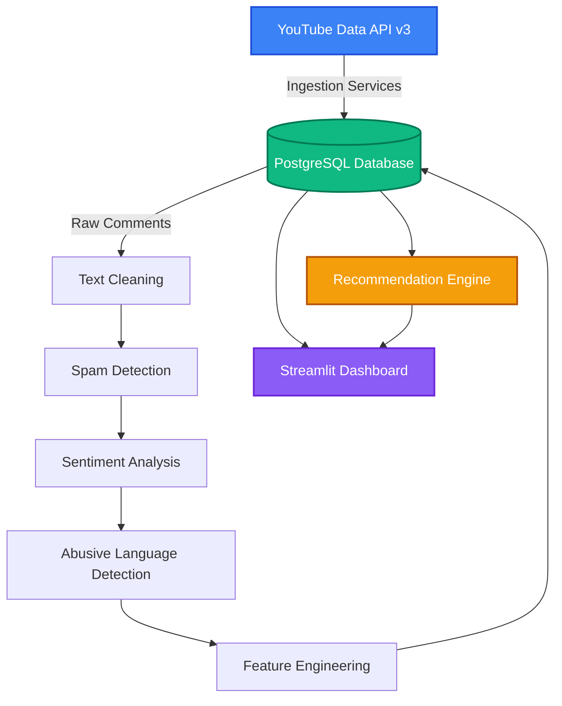
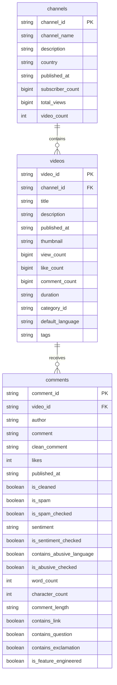

# 📊 InfluenceIQ - YouTube Intelligence Platform

<p align="center">
  
  
  
  
  
  
  
</p>

---

## 🚀 Overview

**InfluenceIQ** is an end-to-end YouTube analytics and influencer intelligence platform. It collects YouTube channel, video, and comment data; stores it in PostgreSQL through SQLAlchemy ORM; enriches comments with NLP pipelines; and presents insights through a multi-page Streamlit dashboard.

The current version includes:

- YouTube Data API v3 ingestion for channels, videos, and comments.
- PostgreSQL persistence with SQLAlchemy declarative models.
- Comment cleaning, spam detection, sentiment analysis, abusive language detection, and feature engineering.
- Interactive Streamlit analytics pages for home metrics, videos, comments, NLP, and executive insights.
- An AI-style recommendation module that scores influencer suitability for brand collaborations.

---

## ✨ System Architecture



---

## 🗄️ Database Schema

The database contains three main entities mapped with SQLAlchemy:



---

## Processing Pipeline

### 1. YouTube Data Ingestion

The API layer fetches:

- Channel metadata and statistics.
- Uploaded video metadata, thumbnails, duration, tags, views, likes, and comment counts.
- Comment threads with authors, raw text, likes, and publish timestamps.

### 2. Text Cleaning

The cleaning pipeline normalizes raw comment text by lowercasing, removing URLs, mentions, hashtags, emojis, special characters, and extra spaces.

### 3. Spam Detection

The spam detector flags promotional or low-quality comments using rule-based keyword matching and link checks.

### 4. Sentiment Analysis

The sentiment pipeline uses VADER compound scoring to classify comments as:

- `Positive`
- `Neutral`
- `Negative`

### 5. Abusive Language Detection

The abusive language pipeline checks normalized comments against a keyword dictionary and marks unsafe comments with `contains_abusive_language`.

### 6. Feature Engineering

The feature pipeline adds structured comment features:

- Word count.
- Character count.
- Length category: `Short`, `Medium`, or `Long`.
- Link, question, and exclamation flags.

---

## Recommendation Engine

The project now includes a complete recommendation package under `src/recommendation/`.

The recommendation engine extracts channel, video, and audience metrics, calculates weighted scores, ranks the influencer, and applies business rules to generate a brand collaboration decision.

### Extracted Metrics

- Subscribers, total views, total videos, likes, and comment volume.
- Engagement rate based on likes and video comments relative to views.
- Positive, neutral, negative, spam, and abusive comment ratios.
- Average video views, likes, comments, word count, and character count.

### Scoring Model

The scoring layer calculates:

- **Engagement Score:** derived from engagement rate.
- **Audience Score:** rewards positive sentiment and penalizes negative, spam, and abusive ratios.
- **Popularity Score:** combines subscriber and view scale.
- **Brand Safety Score:** penalizes spam and abusive content.
- **ROI Score:** combines engagement, audience quality, and popularity.
- **Influence Score:** final weighted score used for ranking and recommendation.

### Business Decision Layer

The business rules convert scores into:

- Final recommendation: `Highly Recommended`, `Recommended`, `Good Choice`, `Average Choice`, or `Avoid`.
- Star rating from 1 to 5.
- Brand safety label.
- ROI potential.
- Investment risk level.
- Confidence score.
- Executive summary.

---

## Dashboard Pages

The Streamlit dashboard is available at `src/dashboard/app.py` and includes:

- **Home:** high-level totals and summary KPIs.
- **Videos:** video-level analytics and performance comparisons.
- **Comments:** raw and cleaned comment exploration.
- **NLP:** sentiment, spam, and abusive-language insights.
- **Insights:** executive analytics for content and audience behavior.
- **Recommendation:** AI Investment Advisor with influence score, brand safety, ROI, risk, radar chart, score breakdown, executive report, final decision, and CSV download.

---

## Project Structure

```text
Influence_IQ/
|-- main.py
|-- README.md
|-- requirements.txt
|-- notebook/
|   |-- 01_Data_Loading.ipynb
|   |-- 02_EDA.ipynb
|   |-- 03_Advanced_Visual_Analytics.ipynb
|-- src/
|   |-- api/
|   |   |-- channel_service.py
|   |   |-- comment_service.py
|   |   |-- video_service.py
|   |   |-- youtube_client.py
|   |-- abusive/
|   |   |-- abusive_detector.py
|   |-- cleaning/
|   |   |-- spam_detector.py
|   |   |-- text_cleaner.py
|   |-- dashboard/
|   |   |-- app.py
|   |   |-- charts.py
|   |   |-- loader.py
|   |   |-- metrics.py
|   |   |-- sidebar.py
|   |   |-- styles.py
|   |   |-- assets/
|   |   |   |-- style.css
|   |   |-- dashboard_pages/
|   |   |   |-- comments.py
|   |   |   |-- home.py
|   |   |   |-- insights.py
|   |   |   |-- nlp.py
|   |   |   |-- recommendation.py
|   |   |   |-- videos.py
|   |-- database/
|   |   |-- connection.py
|   |   |-- crud.py
|   |   |-- loader.py
|   |   |-- models.py
|   |-- features/
|   |   |-- feature_engineering.py
|   |-- pipeline/
|   |   |-- abusive_pipeline.py
|   |   |-- cleaning_pipeline.py
|   |   |-- etl_pipeline.py
|   |   |-- feature_pipeline.py
|   |   |-- sentiment_pipeline.py
|   |   |-- spam_pipeline.py
|   |   |-- youtube_pipeline.py
|   |-- recommendation/
|   |   |-- business_rules.py
|   |   |-- metrics.py
|   |   |-- ranking.py
|   |   |-- recommend.py
|   |   |-- scorer.py
|   |-- repositories/
|   |   |-- channel_repository.py
|   |   |-- comment_repository.py
|   |   |-- video_repository.py
|   |-- sentiment/
|   |   |-- sentiment_analyzer.py
|   |-- utils/
|       |-- abusive_keywords.py
|       |-- file_handler.py
|       |-- logger.py
|       |-- spam_keywords.py
|       |-- validator.py
```

---

## Installation and Configuration

### 1. Clone and Set Up

```bash
git clone https://github.com/aryandhiman01/InfluenceIQ.git
cd InfluenceIQ

python -m venv .venv
```

Activate the environment:

```bash
# Windows
.venv\Scripts\activate

# macOS / Linux
source .venv/bin/activate
```

Install dependencies:

```bash
pip install -r requirements.txt
```

### 2. Configure Environment Variables

Create a `.env` file in the project root:

```env
DATABASE_URL="your_postgresql_connection_string"
YOUTUBE_API_KEY="your_youtube_api_key"
```

---

## Execution

### Run the Pipeline CLI

```bash
python main.py
```

Menu options:

1. Fetch YouTube data.
2. Clean comments.
3. Detect spam.
4. Run sentiment analysis.
5. Detect abusive language.
6. Run feature engineering.
7. Run the complete pipeline.
8. Exit.

### Run the Dashboard

```bash
streamlit run src/dashboard/app.py
```

Then open:

```text
http://localhost:8501
```

---

## Work Completed

- Built modular YouTube ingestion services.
- Created SQLAlchemy models for channels, videos, and comments.
- Added repository and database utility layers.
- Added text cleaning, spam detection, sentiment analysis, abusive detection, and feature engineering pipelines.
- Built a multi-page Streamlit dashboard.
- Added dashboard pages for home, videos, comments, NLP, insights, and recommendation.
- Implemented the recommendation engine with metrics extraction, scoring, ranking, business rules, and final report generation.
- Added visual recommendation outputs including gauge chart, radar chart, score table, score comparison chart, risk analysis, business recommendations, and downloadable report.

---

## Future Enhancements

- Add support for comparing multiple channels in the recommendation engine.
- Add topic modeling to identify recurring audience discussion themes.
- Add historical tracking for channel growth and campaign performance.
- Improve dependency management with a clean production-focused requirements file.
- Containerize the app for deployment.

---

## License

This project is licensed under the **MIT License**. See the `LICENSE` file for details.

---

<p align="center">
  Made by <b>Aryan Dhiman</b> for creators, marketers, and data engineers.
</p>
