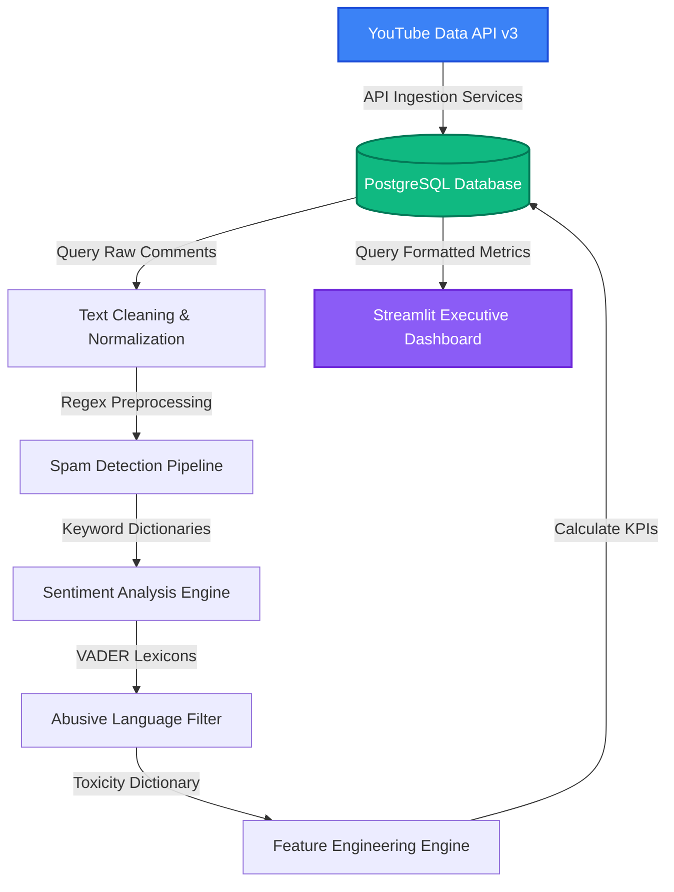
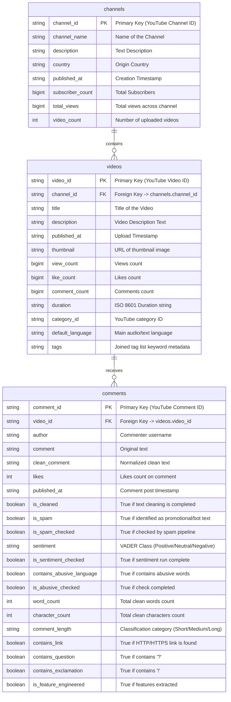

# 📊 InfluenceIQ — YouTube Analytics & Intelligence Platform

<p align="center">
  
  
  
  
  
  
  
</p>

---

## 🚀 Overview

**InfluenceIQ** is an end-to-end data engineering and natural language processing (NLP) intelligence platform designed to scrape, analyze, and visualize YouTube channel metrics, video metadata, and audience comment sentiment. 

The platform connects to the **YouTube Data API v3** to ingest raw data, models database relationships using **SQLAlchemy ORM**, stores records inside a relational **PostgreSQL** database, and executes a multi-stage **NLP Text Cleaning and Enrichment Pipeline** on gathered comments. Finally, it feeds a multi-page **Streamlit dashboard** that provides content creators and marketers with engagement indicators and toxicity alerts.

---

## ✨ System Architecture

The workflow is completely modular, separating data ingestion from text normalization, spam detection, sentiment analysis, and UI visualization.



---

## 🗄️ Relational Database Schema

All database entities are fully mapped using SQLAlchemy Declarative models. Below is the Entity-Relationship Diagram representing the structured database schema:



---

## 🧠 NLP Processing Pipeline Details

The natural language processing system cleans and enriches raw user commentary through five sequential steps:

### 1. Text Preprocessing & Normalization
The engine processes raw text using pre-compiled regex patterns to create standardized strings:
* **Lowercasing:** Converts text entirely to lowercase.
* **URL Removal:** Strips hyperlinks matching `https?://\S+|www\.\S+`.
* **Mentions & Hashtags:** Strips `@username` tags and `#hashtag` metadata keywords.
* **Emoji Extraction:** Strips multi-byte emojis by converting string to ASCII (`ascii ignore`) and rebuilding.
* **Special Characters:** Replaces non-alphanumeric symbols (`[^a-z0-9\s]`) with whitespace.
* **Spacing Collapsing:** Replaces multi-space gaps (`\s+`) with single spaces and strips boundaries.

### 2. Spam Detection Engine
Identifies promotional commentary, bot spam, and repetitious links using dynamic keyword and phrase-dictionary mapping:
* Automatically flags comments containing spam keywords (e.g., *subscribe*, *check out my channel*, *follow me*, *free money*).
* Identifies comments containing raw URL traces.
* Helps filter noise to isolate genuine user engagement.

### 3. Sentiment Analysis Engine
Evaluates emotional polarity in comments using the **VADER Sentiment Intensity Analyzer** (specifically tuned for social media contexts). Polarity scores yield a compound score ($S_{comp}$) bounded between $[-1, 1]$:
$$\text{Compound Score } (S_{comp}) = \frac{\text{sum of valence scores}}{\sqrt{(\text{sum of valence scores})^2 + \alpha}}$$

Based on this score, comments are classified into discrete classes:
* **Positive Polarity:** $S_{comp} \ge 0.05$
* **Negative Polarity:** $S_{comp} \le -0.05$
* **Neutral Polarity:** $-0.05 < S_{comp} < 0.05$

### 4. Toxicity & Abusive Language Filter
Detects aggressive, offensive, or inappropriate comments through dictionary matching:
* Evaluates normalized comments against a compiled dictionary of abusive, toxic, and offensive keywords.
* Tags matching rows with `contains_abusive_language = True` to enable moderation filters on the dashboard.

### 5. Feature Engineering Engine
Extracts structural context and features from each comment:
* **Word Count:** Computes total token length.
* **Character Count:** Computes character sequence length.
* **Categorical Length Classification:**
  * **Short:** $< 5$ words
  * **Medium:** $5$ to $19$ words
  * **Long:** $\ge 20$ words
* **Inquiry Tagging:** Flags comments posing questions (`contains_question = True`) by checking for `?`.
* **Exclamatory Tagging:** Flags comments showing excitement/intensity (`contains_exclamation = True`) by checking for `!`.

---

## 📂 Project Structure

```
InfluenceIQ
├── data/                       # Backups of retrieved datasets
├── notebook/                   # Research notebooks and EDA experiments
├── reports/                    # Aggregated report printouts
├── src/                        # Core application code
│   ├── api/                    # YouTube Data API scraping integration
│   │   ├── channel_service.py  # Ingests channel details & metadata
│   │   ├── video_service.py    # Ingests uploads & video statistics
│   │   ├── comment_service.py  # Ingests comment threads & counts
│   │   └── youtube_client.py   # Initializes Google API client objects
│   ├── abusive/                # Toxicity identification filters
│   │   └── abusive_detector.py # Matches comments against toxic dictionaries
│   ├── cleaning/               # Core preprocessors & spam engines
│   │   ├── text_cleaner.py     # Regex sanitization and ASCII translation
│   │   └── spam_detector.py    # Rules engine to detect promotional bots
│   ├── dashboard/              # Interactive analytics panel views
│   │   └── app.py              # Multi-page dashboard interface
│   ├── database/               # Relational persistence modules
│   │   ├── connection.py       # Establishes SQL engines & session factories
│   │   ├── crud.py             # Basic database operations
│   │   ├── loader.py           # Initializes tables using metadata schema
│   │   └── models.py           # Table classes mapping relations
│   ├── features/               # Statistical enrichment services
│   │   └── feature_engineering.py # Generates structural text metrics
│   ├── pipeline/               # Pipeline execution controllers
│   │   ├── youtube_pipeline.py # Scraping flow orchestrator
│   │   ├── cleaning_pipeline.py# Normalization batch coordinator
│   │   ├── spam_pipeline.py    # Spam pipeline runner
│   │   ├── sentiment_pipeline.py # Sentiment pipeline executor
│   │   ├── abusive_pipeline.py # Toxicity engine batch coordinator
│   │   └── feature_pipeline.py # Feature engineering executor
│   ├── repositories/           # Database interface abstractions
│   ├── sentiment/              # Sentiment modeling config
│   │   └── sentiment_analyzer.py # Runs VADER Compound Scoring models
│   └── utils/                  # Keyword lists & environment keys
├── .env                        # Local configurations (Git ignored)
├── main.py                     # Console pipeline commander CLI
└── requirements.txt            # System dependencies manifest
```

---

## ⚙️ Installation & Configuration

### 1. Initialize Workspace
```bash
# Clone the repository
git clone https://github.com/aryandhiman01/InfluenceIQ.git
cd InfluenceIQ

# Build virtual environment
python -m venv .venv

# Activate on Windows:
.venv\Scripts\activate

# Activate on macOS / Linux:
source .venv/bin/activate

# Install dependencies
pip install -r requirements.txt
```

### 2. Configure Settings (.env)
Create a `.env` file in the root workspace folder:
```env
DATABASE_URL="your_database_connection_string"
YOUTUBE_API_KEY="your_youtube_api_key"
```

---

## ▶️ Execution

### Command Line Console
Run the interactive supervisor script to initialize the database schema and process data batches:
```bash
python main.py
```
**Interactive Options Menu:**
1. **Fetch YouTube Data:** Connects to the API, scrapes details, and saves to database.
2. **Clean Comments:** Runs regex-based sanitization in batches.
3. **Detect Spam:** Filters spam content.
4. **Sentiment Analysis:** Classifies comment sentiment.
5. **Detect Abusive Language:** Identifies offensive statements.
6. **Feature Engineering:** Extracts comment metrics.
7. **Run Complete Pipeline:** Executes all pipeline steps sequentially.
8. **Exit:** Safely closes the database session.

### Streamlit Dashboard
Launch the multi-page visualization panel:
```bash
streamlit run src/dashboard/app.py
```
Open [http://localhost:8501](http://localhost:8501) in your browser.

---

## 📊 Analytics Dashboard Modules

- **🏠 Home Dashboard:** High-level summary of total channels, tracked videos, comment volume, and general view metrics.
- **🎥 Video Analytics:** Highlights engagement rates, views, likes, and comment ratios on a per-video level.
- **💬 Comment Analytics:** Detailed log of comments, comparing raw text to cleaned text side-by-side.
- **🧠 NLP Dashboard:** Visualizes sentiment distributions (positive vs. negative shares), spam ratios, and toxicity alerts over time.
- **📊 Executive Insights:** Actionable audience metrics to guide content and moderation strategies.

---

## 🔮 Future Enhancements
- [ ] Implement real-time streaming pipelines using YouTube API webhooks.
- [ ] Add Topic Modeling (LDA) to classify themes of discussion.
- [ ] Introduce a Machine Learning Recommendation model.
- [ ] Transition the pipeline to containerized Cloud Run deployments.

---
---

## 📄 License

This project is licensed under the **MIT License**. Feel free to use, modify, and distribute this project in accordance with the terms of the license. See the **LICENSE** file for more details.

---

<p align="center">
  Made with ❤️ by <b>Aryan Dhiman</b> for creators, marketers, and data engineers.
</p>*
